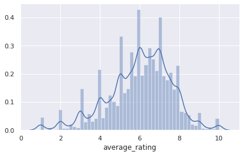

# Board-games-prediction
This project is a part of the machine learning course I took on udemy. The project can be useful for the board games manufacturer who might want to know what types of games people like and which games got the highest ratings.

### Software and Libraries:

    1.pandas
    2.matplotlib
    3.seaborn
    4.sklearn
    5.Python 3
    
### Dataset
Data is a collection of board game information from Board Game Geek.The dataset contains data of Board Games. The dataset has 20 columns.

Dataset : [Board Games Prediction Data](https://www.kaggle.com/centipede148/board-games-prediction-data)

### Images

 

• The above chart shows average rating that most of the rating lies around 6. So after calculation we get
    
    Standard Deviation :  1.5788299348332662
    Average :  6.016112849333889

 

• So we can observe some basic things like id has some correlation with average rating. Also average rating and average weight are also correlated. Also min age is correlated with average rating.

• Some columns like base type,name,id as they dont give useful info about the game. but they are correlated so it will somewhat affect the results of the algorithm.

 

### Key Points
• I have used two models Linear Regression and Random Forest Regressor to predict the average ratings for the board games.using Linear Regression we got MSE 2.08 which is not the best as the data is fairly complex so the linear model won't fit it perfectly.
• Using Random Forest Regressor I get MSE value as 1.56  which is better than the linear regression. So non linear model is achiving better result than the linear model.
    
• Predictions of some values :
 

    
    
## References

    Wikipedia
    Datacamp
    Udemy
    A lot of googling to figure out how to do stuff.    

