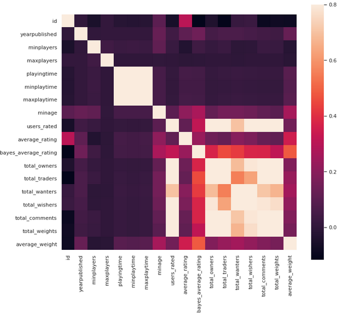

# Board-games-prediction

This project can be useful for the board games manufacturer who might want to know what types of games people like and which games got the highest ratings.

### Software and Libraries:

    1.pandas
    2.matplotlib
    3.seaborn
    4.sklearn
    5.Python 3
    
### Dataset
Data is a collection of board game information from Board Game Geek.The dataset contains data of Board Games. The dataset has 20 columns.

Dataset : [Board Games Prediction Data](https://www.kaggle.com/centipede148/board-games-prediction-data)

### Images

 

• The above chart shows average rating that most of the rating lies around 6. So after calculation we get
    Standard Deviation :  1.5788299348332662
    Average :  6.016112849333889

 

The dataset is large so only few values are printed. Mainly there are 4 columns and are described as below:

    • Date/Time : The date and time of the Uber pickup
    • Lat : The latitude of the Uber pickup
    • Lon : The longitude of the Uber pickup
    • Base : The TLC base company code affiliated with the Uber pickup

 

• So we can observe some basic things like id has some correlation with average rating. Also average rating and average weight are also correlated. Also min age is correlated with average rating.

• Some columns like base type,name,id as they dont give useful info about the game. but they are correlated so it will somewhat affect the results of the algorithm.

 

### Key Points
• I have used two models Linear Regression and Random Forest to predict the average ratings for the board games.using Linear Regression we got MSE 2.08 which is not the best as the data is fairly complex so the linear model won't fit it perfectly.
• Using Random Forest I get MSE value as 1.56  which is better than the linear regression. So non linear model is achiving better result than the linear model.
    
• Predictions of some values :

Predictions of first 5 games using Linear regression model : 
   Predictions
0     8.107099
1     9.214802
2     8.619089
3     7.661229
4     9.672846

Predictions of first 5 games using Random Forest model : 
   Predictions
0     8.128761
1     8.121067
2     7.869606
3     7.664976
4     7.908122
    
    
## References

    Wikipedia
    Datacamp
    A lot of googling to figure out how to do stuff.    

